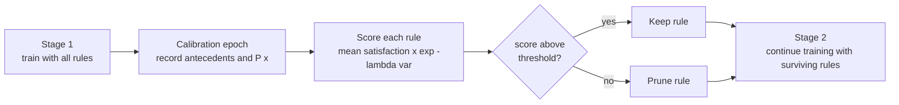

# Two-Stage LTN with Rule Pruning for Predictive Process Monitoring


Official code for the paper

> **Neuro-Symbolic Learning for Predictive Process Monitoring via Two-Stage Logic Tensor Networks with Rule Pruning**

The repository combines data-driven sequence models (LSTM / Transformer) with background knowledge expressed in first-order fuzzy logic, using [Logic Tensor Networks](https://github.com/logictensornetworks/LTNtorch) (LTN). Since hand-written rules are not always reliable, training is organised in **two stages**: all rules are used at first, then the unreliable ones are **pruned** and training continues with the surviving knowledge only.

---

## Table of contents

- [Overview](#overview)
- [Repository structure](#repository-structure)
- [Installation](#installation)
- [Datasets](#datasets)
- [Running the experiments](#running-the-experiments)
- [Multiple seeds](#multiple-seeds)
- [Declarative constraints as FOL formulas](#declarative-constraints-as-fol-formulas)
- [Citation](#citation)

---

## Overview

Each prefix of a trace is classified by a backbone model `P(x)` (the LTN predicate). The loss combines two groups of fuzzy axioms:

- **Data axioms**: positive prefixes satisfy `P(x)`, negative prefixes satisfy `¬P(x)`.
- **Knowledge axioms**: for every rule `r`, `antecedent_r(x) → P(x)` (or `→ ¬P(x)` for negative rules).

```
loss = 1 − ( 0.8 · SAT(data axioms) + 0.2 · SAT(knowledge axioms) )
```

### Training variants

| Flag | Variant | Description |
|---|---|---|
| `--train_vanilla` | Vanilla | Plain LSTM / Transformer trained with BCE, no logic. |
| `--train_ltn_no_rules` | LTN w/o rules | LTN with the data axioms only. |
| `--train_ltn_no_pruning` | LTN w/ all rules | Data and knowledge axioms in a single aggregation. |
| `--train_ltn_no_pruning_weighted` | LTN weighted loss | Data / knowledge mixed with fixed coefficients, no pruning. |
| `--train_ltn_pruning` | **Two-stage LTN** | All rules in the first stage, then pruning of unreliable rules. |
| `--train_ltn_adaptive` | LTN-Adaptive | All rules kept; per-rule weights adjusted during training. |

### Two-stage training with rule pruning



A rule is scored by the mean satisfaction of its implication, penalised by the variance across examples: `score = mean · exp(−λ · var)`. Rules below the gate threshold are dropped for the rest of training. Model selection uses the validation F1.

### Adaptive rule weighting

As an alternative to hard pruning, the **LTN-Adaptive** variants (`LTN-Adaptive-L` for the LSTM backbone, `LTN-Adaptive-T` for the Transformer) keep the whole knowledge base and assign a global weight to every axiom, updated at the end of each epoch. After a warm-up with uniform weights, each rule is compared with the data objective through the cosine similarity between their gradients on the classification head. Weights follow an exponentiated-gradient update and enter a weighted p-mean aggregation of the satisfaction errors; a uniform floor is annealed towards zero so that harmful rules can fade out.

---

## Repository structure

```
.
├── main_sepsis.py              # experiments on Sepsis
├── main_bpi12.py               # experiments on BPIC2012
├── main_bpi17.py               # experiments on BPIC2017
├── main_traffic.py             # experiments on Traffic Fines
├── run_seeds.py                # run a script over several seeds, report mean ± std
├── metrics.py                  # evaluation metrics (accuracy, F1, precision, recall, compliance)
├── data/
│   ├── preprocess_sepsis.py
│   ├── preprocess_bpi12.py
│   ├── preprocess_bpi17.py
│   ├── preprocess_traffic.py
│   └── dataset.py              # dataset class and model configuration
├── model/
│   ├── lstm.py                 # LSTM backbone
│   └── transformer.py          # Transformer backbone
├── declare_ltn_templates.py    # Declare constraints as LTN predicates (in progress)
├── declare_to_fol_templates.pdf
└── knowledge_base.txt
```

---

## Installation

```bash
git clone https://github.com/FabrizioDeSantis/NeSy-PPM.git
cd NeSy-PPM

python -m venv .venv
source .venv/bin/activate

pip install torch LTNtorch numpy pandas scikit-learn
```

A GPU is used automatically when available.

---

## Datasets

The event logs are public and can be downloaded from the 4TU repository:

| Log | Link |
|---|---|
| BPIC 2012 | [4TU](https://data.4tu.nl/articles/dataset/BPI_Challenge_2012/12689204) |
| BPIC 2017 | [4TU](https://data.4tu.nl/datasets/34c3f44b-3101-4ea9-8281-e38905c68b8d/1) |
| Sepsis | [4TU](https://data.4tu.nl/datasets/33632f3c-5c48-40cf-8d8f-2db57f5a6ce7/1) |
| Traffic fines | [4TU](https://data.4tu.nl/datasets/806acd1a-2bf2-4e39-be21-69b8cad10909/1) |

Place the CSV files in `data_processed/`. The expected file name is set by the `DATA_PATH` constant at the top of each `main_*.py` script. Raw logs are converted into prefix/label tensors by the corresponding `data/preprocess_*.py` module.

---

## Running the experiments

Each `main_*.py` script runs one or more training variants on one dataset and prints the test metrics.

```bash
python main_sepsis.py --model_type lstm --setting compliance --seed 42 \
    --train_vanilla --train_ltn_pruning --train_ltn_adaptive
```

### Options

| Argument | Default | Description |
|---|---|---|
| `--model_type` | `transformer` | Backbone: `lstm` or `transformer`. |
| `--setting` | `compliance` | Experimental setting: `compliance` or `temporal`. |
| `--seed` | `42` | Seed for parameters and data splitting. |
| `--num_epochs` | `50` | Training epochs of the vanilla model. |
| `--num_epochs_nesy` | `50` | Training epochs of the LTN models. |
| `--hidden_size` | `128` | Hidden size of the backbone. |
| `--num_layers` | `2` | Number of LSTM layers. |
| `--dropout_rate` | `0.1` | Dropout rate. |
| `--train_*` | off | Select the variants to run (see the table above). |
| `--results_path` | none | Dump the test metrics of all selected variants to a JSON file. |

Metrics reported on the test set: accuracy, macro F1, precision, recall and, for the LTN models, rule **compliance**.

---

## Multiple seeds

`run_seeds.py` launches a script once per seed and aggregates the results into mean and standard deviation.

```bash
python run_seeds.py --script main_sepsis.py --seeds 0 1 2 3 4 \
    --model_type lstm --train_ltn_pruning --train_ltn_adaptive
```

Every argument that `run_seeds.py` does not recognise is forwarded to the script. Output is written to `results/`:

| File | Content |
|---|---|
| `seed_<k>.json`, `seed_<k>.log` | Raw metrics and full log of each run. |
| `all_runs.csv` | One row per seed, variant and metric. |
| `summary.csv`, `summary_table.csv` | Mean, standard deviation and `mean ± std` table. |

Runs are sequential, and finished seeds are cached, so an interrupted experiment can be resumed with the same command.

---

## Declarative constraints as FOL formulas

Control-flow knowledge is often expressed with [Declare](https://doi.org/10.1007/s00450-009-0057-9) templates. `declare_to_fol_templates.pdf` gives the translation of Declare constraints into first-order logic formulas that can be used as knowledge axioms in an LTN. `declare_ltn_templates.py` implements these templates as LTN predicates *(work in progress)*.

---

## Citation

If you use this code, please cite the paper:

```bibtex
@inproceedings{de2026neuro,
  title={Neuro-symbolic learning for predictive process monitoring via two-stage logic tensor networks with rule pruning},
  author={De Santis, Fabrizio and Park, Gyunam and Zanichelli, Francesco},
  booktitle={Pacific-Asia Conference on Knowledge Discovery and Data Mining},
  pages={104--118},
  year={2026},
  organization={Springer}
}
```

## Contact

For questions or issues, please open a GitHub issue.